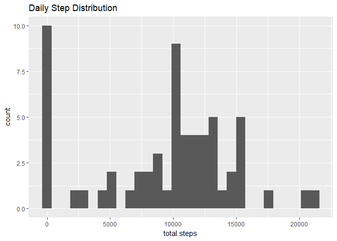
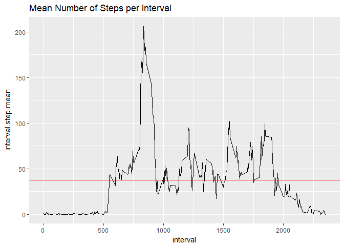

# Reproducible Research: Peer Assessment 1


## Loading and preprocessing the data
The supplied data is read and stored in a data frame, data.  The 'lubridate' package is utilized for
transforming the date column factors to the 'date' class.


```
## 
## Attaching package: 'lubridate'
```

```
## The following object is masked from 'package:base':
## 
##     date
```

## What is mean total number of steps taken per day?
For this computation we will look at the 'steps' variable in the data frame.  The 'NA' values are 
ignored in this instance.  To answer this question we will need to:

1. Calculate the total number of steps per day
2. Calculate the mean & median dialy steps


```r
meanSteps <- mean(tapply(data$steps, data$date, sum, na.rm = TRUE))
meanSteps
```

```
## [1] 9354.23
```

```r
medianSteps <- median(tapply(data$steps, data$date, sum, na.rm = TRUE))
medianSteps
```

```
## [1] 10395
```

A histogram will show us the distribution of total daily steps taken.  To compute this using ggplot, we
need to first make a new dataframe with the days and the total steps taken on each day.


```r
library(ggplot2)
sumSteps <- tapply(data$steps, data$date, sum, na.rm = TRUE)
stepDays <- unique(data$date)
dailyTotals <- data.frame(date = stepDays, total.steps = sumSteps)
qplot(total.steps, data = dailyTotals, main = "Daily Step Distribution")
```

```
## `stat_bin()` using `bins = 30`. Pick better value with `binwidth`.
```

<!-- -->
It can be seen that approximately 10,000 steps is the most frequent daily outcome, when the NA (seen at zero) are ignored.  The distribution appears to be somewhat normal.

## What is the average daily activity pattern?
We want to observe the daily activity pattern across all days by comparing the amount of steps
in a five minute interval to the average number of steps taken, averaged across all the days data was
taken.  

```r
intervalMean <- mean(tapply(data$steps, data$date, mean, na.rm = TRUE), na.rm = TRUE)
qplot(interval, steps, data = data, geom = "line", main = "Number of Steps per Interval") + geom_hline(yintercept = intervalMean, col = "red")
```

```
## Warning: Removed 2 rows containing missing values (geom_path).
```

<!-- -->

## Imputing missing values


## Are there differences in activity patterns between weekdays and weekends?
